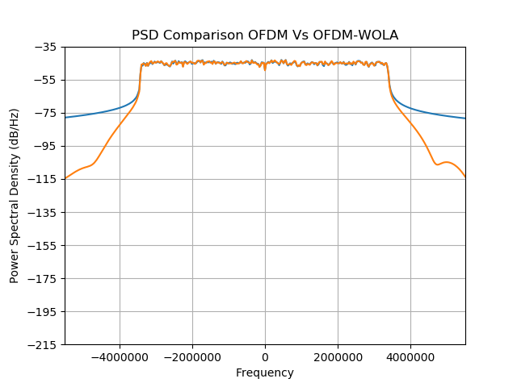

# 5G_NR_Simulations
5G New Radio Simulations written in Python with descriptive Plots
Building a detailed Simulation of 5G New Radio Technology along with Wireless channel and System Bourne deformities.
Downlink and Uplink Waveforms have been build.
Currently, working on Channel Models and Defects in System which causes various distortion in the Communication Systems.

# Plot WaveForm-1
Below is a PSD plot of 5G Downlik Waveform : Blue (Without WOLA) Vs Red (With Wola) 

